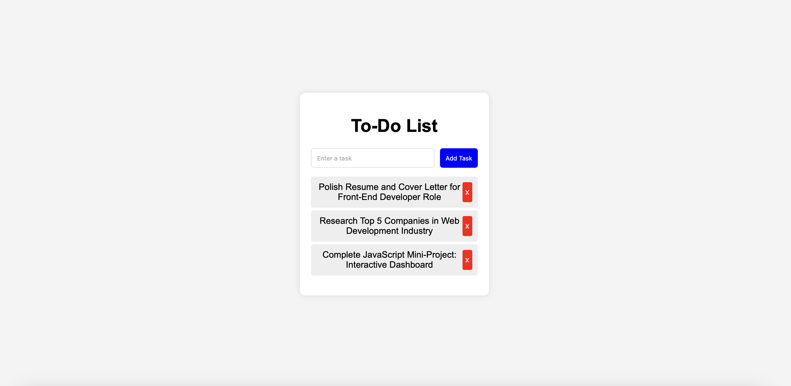

To-Do List App

A simple, lightweight, and responsive To-Do List application built using HTML, CSS, and JavaScript. It allows users to add, delete, and store tasks using localStorage, so tasks remain saved even after refreshing the page.

Features
Add tasks dynamically.
Delete tasks with a click.
Saves tasks in `localStorage`.
Responsive design for mobile & desktop.

Screenshot
  

File Structure
